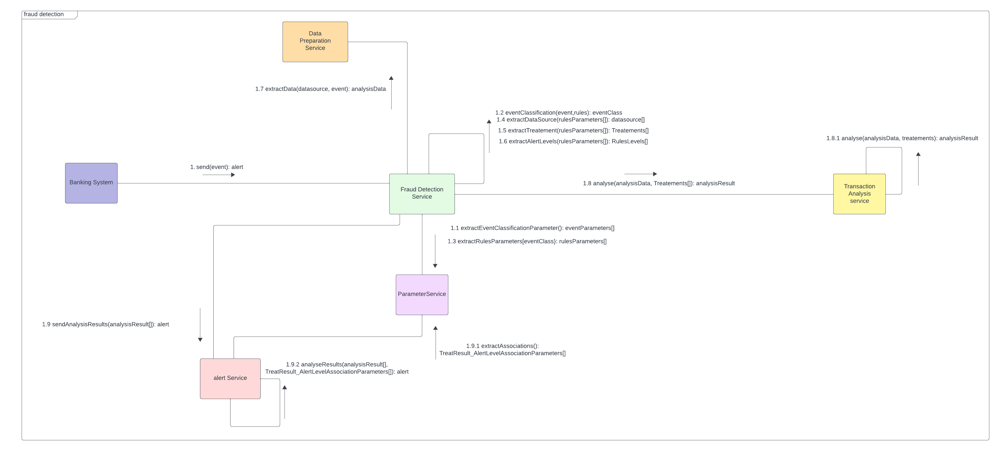
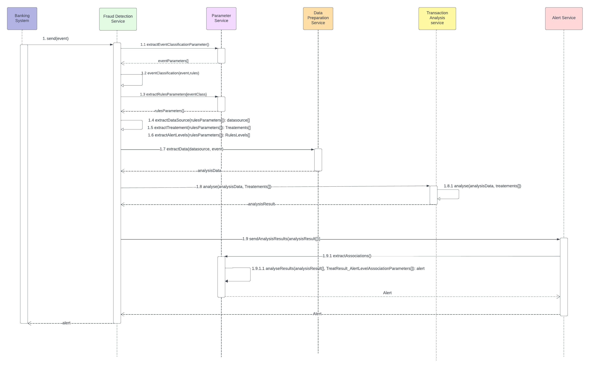

# CONCEPTION ET DEVELOPPEMENT D'UN SYSTEME DE DETECTION DES FRAUDES

## 1. Introduction au Projet:

Dans le monde dynamique des services bancaires, la sécurité et l'intégrité des transactions sont primordiales. Afin de garantir la détection précoce et efficace des activités frauduleuses, un système de détection de fraude est essentiel. Notre système de détection de fraude est conçu pour répondre à cette nécessité croissante en offrant une solution robuste et adaptable pour les institutions financières.

### Objectif du Projet

Le système de détection de fraude a pour objectif principal de recevoir, analyser et signaler les événements provenant des systèmes bancaires. Ces événements comprennent une gamme variée de transactions, de mouvements de fonds et d'activités financières. Notre système est conçu pour identifier les schémas et les comportements suspects, permettant ainsi aux institutions financières de réagir rapidement pour prévenir les risques liées à la fraude.

### Flexibilité et Paramétrage

Ce qui distingue notre système, c'est sa capacité à être entièrement paramétrable par l'administrateur du système externe. L'administrateur à la possibilité de définir et de configurer les règles de gestion nécessaire . Cela comprend la paramétrisation des événements à surveiller, des sources de données à intégrer, des traitements à exécuter sur ces données et des résultats attendus de ces traitements. De plus, l'interprétation des résultats en termes de niveaux d'alerte est également configurable, permettant une adaptation précise aux besoins et aux politiques de sécurité de chaque institution.

### Avantages Attendus

En permettant une personnalisation approfondie, notre système offre une flexibilité inégalée pour répondre aux besoins spécifiques de chaque institution financière. En détectant rapidement les activités frauduleuses et en fournissant des alertes en temps réel, notre système aide à réduire les risques et à protéger les comptes des clients. Tout en offrant une interface intuitive et conviviale pour la configuration des règles de détection, notre système facilite la gestion et la maintenance continues, garantissant une efficacité opérationnelle maximale.

## 2. Vue d'Ensemble du Système

Le système de détection de fraude est composé de plusieurs services interconnectés, chacun jouant un rôle crucial dans le processus global de détection et de notification des activités frauduleuses.

*architecture du système*
### Fraud Detection Service :

Ce service central est responsable de recevoir les événements provenant des systèmes bancaires externes.
Il fonctionne selon deux modes :
- **Mode Push** :Les événements sont envoyés directement par le système externe via un web service.
- **Mode Pull** : Les événements sont consommés à partir d'un courtier (broker) ou d'une file d'attente.
  Le service analyse les événements reçus et génère des alertes en fonction des paramètres configurés.
### Parameter Service :

Ce service est chargé de gérer la configuration globale du système de détection de fraude.
L'administrateur utilise ce service pour configurer :
- **Les événements à analyser**
- **Les traitements à appliquer à ces événements**
- **Les sources de données nécessaires pour effectuer les traitements.**
- **Les différents résultats possibles des traitements.**
- **Les niveaux d'interprétation des résultats en termes d'alertes.**
### Data Preparation Service :

Ce service prépare les données nécessaires à l'analyse des événements.
Il récupère les données pertinentes des sources configurées par le Parameter Service et les prépare pour l'analyse ultérieure.
### Transaction Analysis Service :

Ce service analyse les événements de fraude à l'aide des données préparées par le Data Preparation Service.
Il applique les règles de gestion spécifiques à chaque événement, telles que définies dans les paramètres.
Le service génère des résultats d'analyse détaillés pour chaque événement.
### Alert Service :

Ce service prend les résultats d'analyse générés par le Transaction Analysis Service et les traduit en alertes exploitables.
Il classe les alertes en fonction de leur gravité et de leur urgence, selon les niveaux d'interprétation définis dans les paramètres.
Les alertes sont ensuite transmises aux parties concernées pour appliquer les actions correctives nécessaire.

---
Ce système modulaire et interconnecté permet une gestion efficace des événements de fraude, en garantissant une détection rapide et précise tout en offrant la flexibilité nécessaire pour s'adapter aux besoins spécifiques de chaque institution financière.

## 3. Conception du Systeme:

### Diagramme de use case :

Ce diagramme de cas d'utilisation représente le processus de détection des fraudes bancaires.
Il met en lumière les interactions entre les différents acteurs et les fonctionnalités clés du système.

#### Acteurs Principaux :

- **Fraud Detection Admin** : Cet acteur est responsable de la définition 
des règles de gestion pour la détection des fraudes. Il a la capacité 
de définir les événements, les sources de données, les traitements 
et les alertes associées à la détection des fraudes. Il configure également 
les règles de gestion avec une relation incluse du cas d'utilisation 
"Validation Workflow".

- **Adria Banking System** : Cette application bancaire agit en tant 
qu'acteur principal dans l'envoi et la gestion des événements liés aux 
transactions bancaires. Elle interagit avec le système de détection 
de fraude en fournissant des données pertinentes pour l'analyse.
Nous avons adopté une approche qui vise 
à garantir la standardisation et l'interopérabilité avec différents systèmes bancaires.

### Diagramme de classe :

Ce diagramme de classe représente la structure des entités clés impliquées 
dans notre système de détection de fraude bancaire. Les classes sont conçues 
pour capturer les différents aspects des traitements, règles, sources de données, 
événements et alertes associés à la détection de fraude.

#### Classe Rule :
Cette classe comprend les attributs suivants :

- code : Le code de la règle.
- name : Le nom de la règle.
- description : La description détaillée de la règle.

#### Classe Event :
Cette classe comprend les attributs suivants :

- id : L'identifiant unique de l'événement.
- name : Le nom de l'événement.
- description : La description détaillée de l'événement.
- type : Le type de l'événement.

#### Classe DataSource :
Cette classe comprend les attributs suivants :

- id : L'identifiant unique de la source de données.
- name : Le nom de la source de données.
- type : Le type de la source de données, représenté par une énumération avec les valeurs "SQL Database", "Web Service" ou "Cache Database".

#### Classe Treatment :
Cette classe comprend les attributs suivants :

- id : L'identifiant unique du traitement.
- name : Le nom du traitement.
- type : Le type de traitement, représenté par une énumération avec les valeurs "RESTful", "SOAP", "Serverless", "Broker" ou "Queue".

#### Classe TreatmentResult: 
Cette classe comprend les attributs suivants :

- code : Le code de résultat du traitement.
- name : Le nom du traitement.
- description : La description détaillée du traitement.
- severity : L'importance du résultat, représentée par une énumération avec les valeurs "low", "medium" et "high".

#### Classe Alert : 
Cette classe comprend les attributs suivants :

- code : Le code de l'alerte.
- body : Le contenu de l'alerte.

#### Classe AlertLevel : 
Cette classe comprend les attributs suivants :

- id : L'identifiant unique du niveau d'alerte.
- name : Le nom du niveau d'alerte.

### Diagramme de communication :

#### Participants (services) :

- Banking System
- Fraud Detection Service
- Parameter Service
- Data Preparation Service
- Transaction Analysis Service
- Alert Service

#### Interactions :

- Banking System envoie une alerte à Fraud Detection Service.
- Fraud Detection Service communique avec Parameter Service pour extraire les paramètres de classification de l'événement.
- Fraud Detection Service s'occupe de la classification des evenements.
- Fraud Detection Service communique avec Parameter Service pour extraire les parametres des regles.
- Fraud Detection Service s'occupe de l'extraction des sources de données,l'extraction des traitements et niveaux d'alerte.
- Fraud Detection Service communique avec Data Preparation Service pour extraire les données pertinentes des sources de données spécifiées.
- Fraud Detection Service communique avec Transaction Analysis Service pour envoyer les données et les traitements.**
- Fraud Detection Service communique avec Alert Service pour envoyer le resultat de l'analyse.
- Alert Service communique avec Parameter Service pour extraire les associations entre les résultats d'analyse et les niveaux d'alerte.
- Alert Service communique avec lui-même pour analyser les résultats d'analyse et générer des alertes.

### Diagramme de sequence :

Nous devons d'abord identifier les participants et leurs interactions.

#### Participants (services) :

- Banking System
- Fraud Detection Service
- Parameter Service
- Data Preparation Service
- Transaction Analysis Service
- Alert Service

#### Interactions séquence:

- Banking System envoie une alerte à Fraud Detection Service.
- Fraud Detection Service extrait les paramètres de classification de l'événement.
- Fraud Detection Service classifie l'événement en utilisant des règles.
- Fraud Detection Service extrait les paramètres de règles.
- Fraud Detection Service extrait les sources de données, les traitements et les niveaux d'alerte.
- Fraud Detection Service extrait les données pertinentes des sources de données spécifiées.
- Data Preparation Service prépare les données pour l'analyse.
- Data Preparation Service envoie les données préparées à Transaction Analysis Service.
- Transaction Analysis Service analyse les données avec les traitements spécifiés.
- Transaction Analysis Service envoie les résultats d'analyse à Alert Service.
- Alert Service extrait les associations entre les résultats d'analyse et les niveaux d'alerte.
- Alert Service analyse les résultats d'analyse et génère des alertes.

