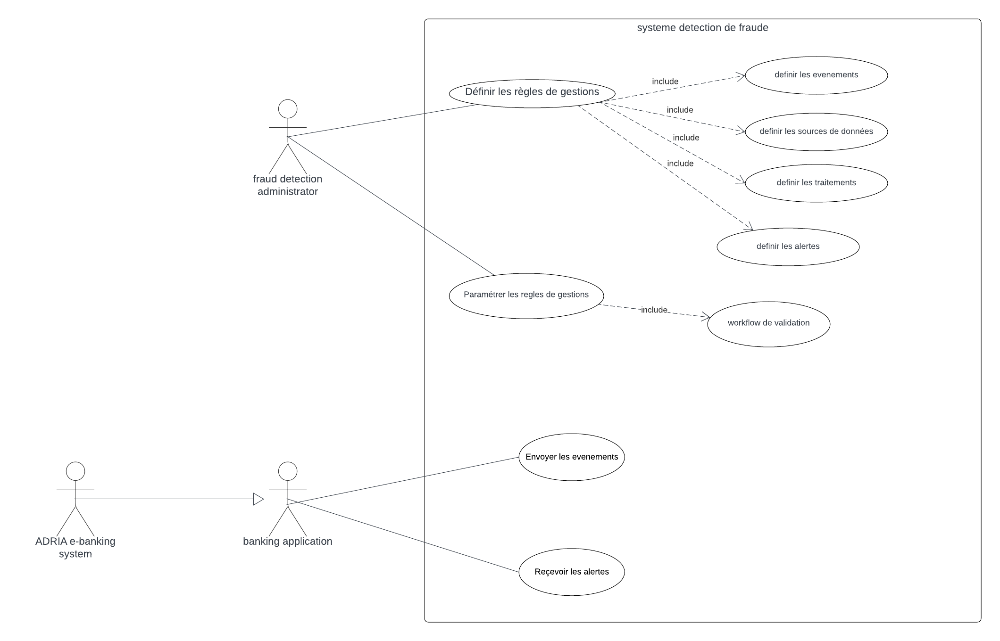
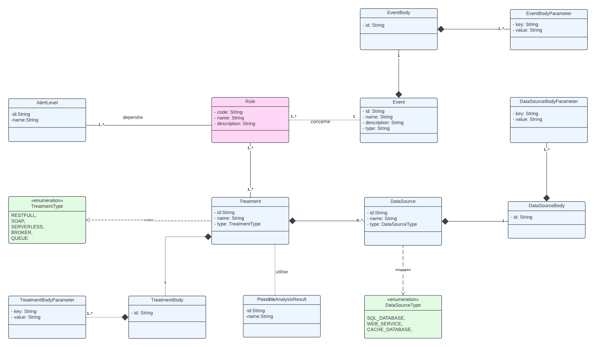
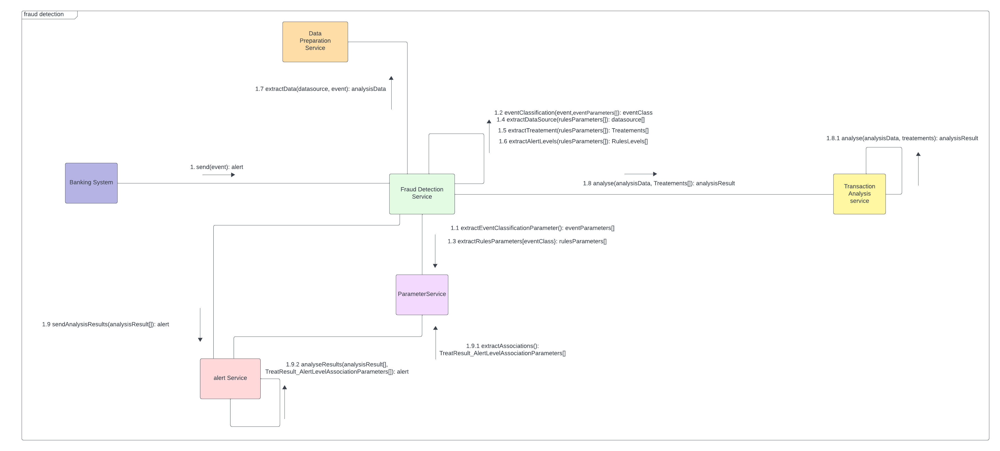
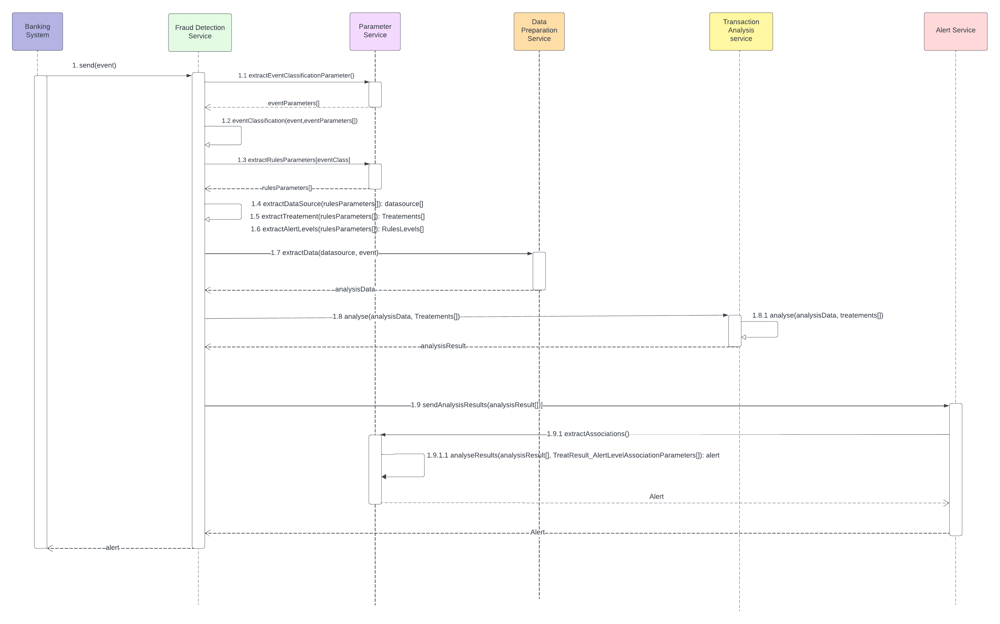
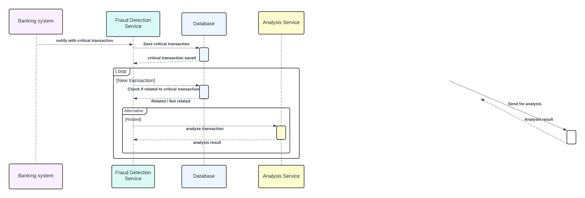
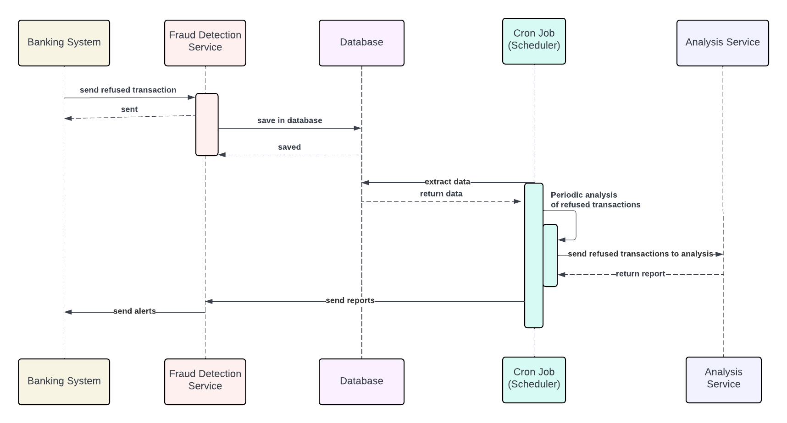
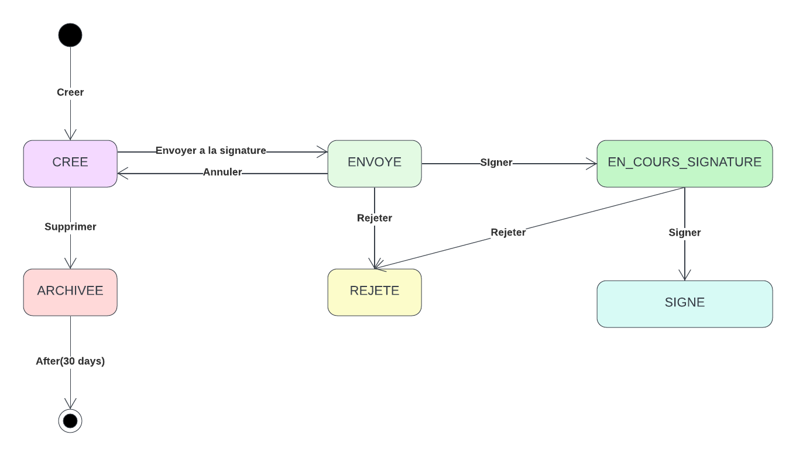

##  Conception du Système:
---
### 1.Diagramme de use case :

Ce diagramme de cas d'utilisation représente le processus de détection des fraudes bancaires.
Il met en lumière les interactions entre les différents acteurs et
les fonctionnalités clés du système.

#### Acteurs Principaux :

- **Fraud Detection Admin** : Cet acteur est responsable de la définition
  des règles de gestion pour la détection des fraudes. Il a la capacité
  de définir les événements, les sources de données, les traitements
  et les alertes associées à la détection des fraudes.

- **Adria Banking System** : Cette application bancaire agit en tant
  qu'acteur principal dans l'envoi et la gestion des événements liés aux
  transactions bancaires. Elle interagit avec le système de détection
  de fraude en fournissant des données pertinentes pour l'analyse.
  Nous avons adopté une approche qui vise
  à garantir la standardisation et l'interopérabilité avec différents systèmes bancaires.
---

### 2-Diagramme de classe :

Ce diagramme de classe représente la définition des règles de gestion.

#### Classe Rule :
Cette classe comprend les attributs suivants :

- code : Le code de la règle.
- name : Le nom de la règle.
- description : La description détaillée de la règle.

#### Classe Event :
Cette classe comprend les attributs suivants :

- id : L'identifiant unique de l'événement.
- name : Le nom de l'événement.
- description : La description détaillée de l'événement.
- type : Le type de l'événement.

#### Classe DataSource :
Cette classe comprend les attributs suivants :

- id : L'identifiant unique de la source de données.
- name : Le nom de la source de données.
- type : Le type de la source de données, représenté par une énumération avec les valeurs "SQL Database", "Web Service" ou "Cache Database".

#### Classe Treatment :
Cette classe comprend les attributs suivants :

- id : L'identifiant unique du traitement.
- name : Le nom du traitement.
- type : Le type de traitement, représenté par une énumération avec les valeurs "RESTful", "SOAP", "Serverless", "Broker" ou "Queue".

#### Classe TreatmentResult:
Cette classe comprend les attributs suivants :

- code : Le code de résultat du traitement.
- name : Le nom du traitement.
- description : La description détaillée du traitement.
- severity : L'importance du résultat, représentée par une énumération avec les valeurs "low", "medium" et "high".

#### Classe Alert :
Cette classe comprend les attributs suivants :

- code : Le code de l'alerte.
- body : Le contenu de l'alerte.

#### Classe AlertLevel :
Cette classe comprend les attributs suivants :

- id : L'identifiant unique du niveau d'alerte.
- name : Le nom du niveau d'alerte.
---

### 3-Diagramme de communication :

#### Participants (services) :

- Banking System
- Fraud Detection Service
- Parameter Service
- Data Preparation Service
- Transaction Analysis Service
- Alert Service

#### Interactions :

- Banking System envoie une alerte à Fraud Detection Service.
- Fraud Detection Service communique avec Parameter Service pour extraire les paramètres de classification de l'événement.
- Fraud Detection Service s'occupe de la classification des evenements.
- Fraud Detection Service communique avec Parameter Service pour extraire les parametres des regles.
- Fraud Detection Service s'occupe de l'extraction des sources de données,l'extraction des traitements et niveaux d'alerte.
- Fraud Detection Service communique avec Data Preparation Service pour extraire les données pertinentes des sources de données spécifiées.
- Fraud Detection Service communique avec Transaction Analysis Service pour envoyer les données et les traitements.**
- Fraud Detection Service communique avec Alert Service pour envoyer le resultat de l'analyse.
- Alert Service communique avec Parameter Service pour extraire les associations entre les résultats d'analyse et les niveaux d'alerte.
- Alert Service fait un traitement génèrent des alertes.

---

### 4-Diagramme de sequence :

#### 4.1-Diagramme de séquence d'analyse pour une transaction critique:

#### 4.2-.Diagramme de séquence d'analyse d'une transaction refusée:

---

## 5.Diagramme états-transitions (State diagram) de Modification du Paramétrage:

### But de section
Cette section vise à décrire le processus de demande de modification du paramétrage du système de détection de fraude, incluant un workflow de validation pour garantir l'intégrité et la sécurité du système.

### Processus de Demande de Modification

Le processus de demande de modification du paramétrage comprend plusieurs étapes, depuis la création de la demande jusqu'à sa validation et son application dans le système. Voici une description détaillée de chaque étape :

#### 1. Création de la demande :
* Le processus commence par la création d’une demande. Un utilisateur ou un administrateur initie cette demande en identifiant les modifications nécessaires dans le paramétrage du système de détection de fraude.
#### 2. Envoi pour signature :
* Une fois la demande créée, elle est envoyée pour signature. Les parties concernées (par exemple, les responsables de la sécurité ou les gestionnaires) doivent approuver ou rejeter la demande.
* Si la demande est annulée avant d’être signée, elle est marquée comme “ANNULÉE”. Cela peut se produire si les conditions changent ou si la demande n’est plus nécessaire.
#### 3. En cours de signature :
* Si la demande est en cours de signature, elle est dans l’état “EN COURS DE SIGNATURE”. Elle attend l’approbation des parties concernées.
* Si la demande est rejetée, elle est marquée comme “REJETÉE”. Cela peut se produire si la demande ne répond pas aux critères de sécurité ou si elle est jugée inappropriée.
#### 4. Signature de la demande :
* Une fois que toutes les parties concernées ont signé la demande, elle est marquée comme “SIGNÉE”. Cela signifie que le changement de paramétrage peut être effectué en toute sécurité.

Le diagramme d'état transition ci-dessous illustre les différents états qu'une demande de modification de paramétrage peut traverser pendant le processus de validation :

