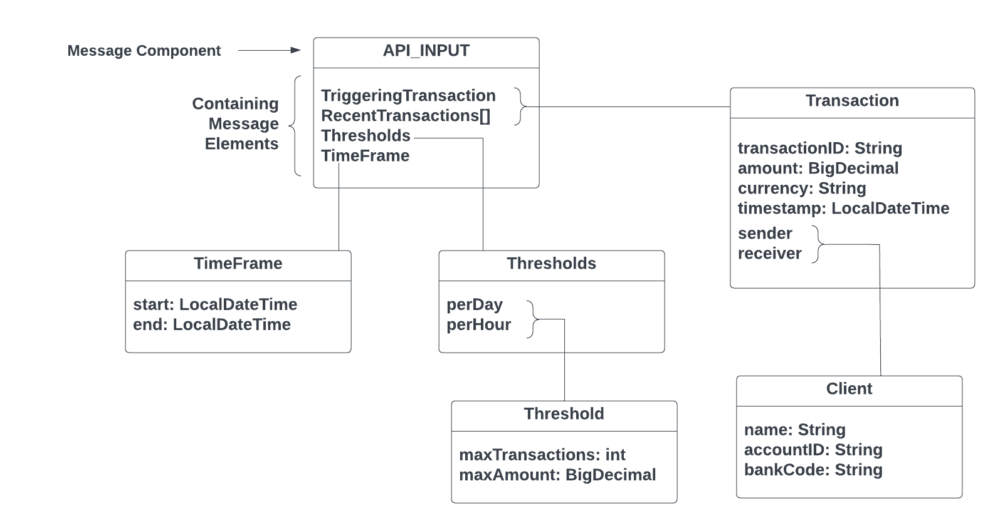
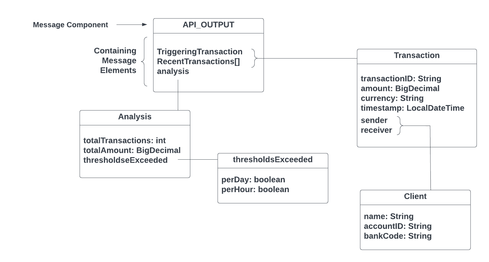

# Documentation de l'API : Vérification de la Fréquence des Transactions

## Aperçu

Cette API est conçue pour vérifier la fréquence des transactions en analysant les transactions déclenchantes et récentes dans une période de temps spécifiée et par rapport à des seuils définis.

## Entrée

### Transaction Déclenchante
- Description : La transaction qui déclenche l'appel à l'API.
- Structure :
    - `transaction_id` : Identifiant unique de la transaction.
    - `amount` : Montant de la transaction.
    - `currency` : Devise de la transaction.
    - `timestamp` : Horodatage de la transaction.
    - `sender` : Informations sur l'expéditeur.
        - `name` : Nom de l'expéditeur.
        - `account_number` : Numéro de compte de l'expéditeur.
        - `bank_code` : Code bancaire de l'expéditeur.
    - `receiver` : Informations sur le destinataire.
        - `name` : Nom du destinataire.
        - `account_number` : Numéro de compte du destinataire.
        - `bank_code` : Code bancaire du destinataire.

### Transactions Récentes
- Description : Liste des transactions récentes pour l'analyse.
- Structure :
    - Chaque transaction contient des détails essentiels tels que l'identifiant de la transaction, le montant, la devise, l'horodatage, les informations sur l'expéditeur et les informations sur le destinataire.

### Période de Temps
- Description : Période de temps pour l'analyse des transactions.
- Structure :
    - `start` : Horodatage de début de la période de temps.
    - `end` : Horodatage de fin de la période de temps.

### Seuils
- Description : Paramètres pour définir les seuils de fréquence des transactions.
- Structure :
    - `per_hour` : Nombre maximum de transactions et montant autorisé par heure.
    - `per_day` : Nombre maximum de transactions et montant autorisé par jour.

### Format du Message d'entrée

*format de message d'entrée*

### exemple

```json
{
  "triggering_transaction": {
    "transaction_id": "123456789",
    "amount": 15000,
    "currency": "MAD",
    "timestamp": "2024-03-25T10:30:00",
    "sender": {
      "name": "Mohammed Ahmed",
      "account_number": "MA123456789",
      "bank_code": "BKMA001"
    },
    "receiver": {
      "name": "Fatima El Haddad",
      "account_number": "MA987654321",
      "bank_code": "BKMA002"
    }
  },
  "recent_transactions": [
    {
      "transaction_id": "123456788",
      "amount": 8000,
      "currency": "MAD",
      "timestamp": "2024-03-25T09:30:00",
      "sender": {
        "name": "Amina Bouzidi",
        "account_number": "MA555555555",
        "bank_code": "BKMA003"
      },
      "receiver": {
        "name": "Ahmed Ziani",
        "account_number": "MA888888888",
        "bank_code": "BKMA004"
      }
    },
    {
      "transaction_id": "123456787",
      "amount": 12000,
      "currency": "MAD",
      "timestamp": "2024-03-25T08:30:00",
      "sender": {
        "name": "Karim El Mansouri",
        "account_number": "MA222222222",
        "bank_code": "BKMA005"
      },
      "receiver": {
        "name": "Zahraa Oudrhiri",
        "account_number": "MA999999999",
        "bank_code": "BKMA006"
      }
    }
  ],
  "timeframe": {
    "start": "2024-03-25T00:00:00",
    "end": "2024-03-25T23:59:59"
  },
  "thresholds": {
    "per_hour": {
      "max_transactions": 3,
      "max_amount": 40000
    },
    "per_day": {
      "max_transactions": 10,
      "max_amount": 100000
    }
  }
}
```


## Sortie

### Rapport

*   Description : Rapport d'analyse basé sur les données d'entrée fournies.
*   Structure :
    *   `triggering_transaction` : Détails de la transaction déclenchante.
    *   `recent_transactions` : Liste des transactions récentes.
    *   `analysis` : Résultats de l'analyse.
        *   `total_transactions` : Nombre total de transactions analysées.
        *   `total_amount` : Montant total des transactions analysées.
        *   `thresholds_exceeded` : Indicateur de dépassement des seuils (par heure et par jour).

### Format du Message de sortie

*format de message de sortie*

### exemple

```json
{
  "report": {
    "triggering_transaction": {
      "transaction_id": "123456789",
      "amount": 15000,
      "currency": "MAD",
      "timestamp": "2024-03-25T10:30:00",
      "sender": {
        "name": "Mohammed Ahmed",
        "account_number": "MA123456789",
        "bank_code": "BKMA001"
      },
      "receiver": {
        "name": "Fatima El Haddad",
        "account_number": "MA987654321",
        "bank_code": "BKMA002"
      }
    },
    "recent_transactions": [
      {
        "transaction_id": "123456788",
        "amount": 8000,
        "currency": "MAD",
        "timestamp": "2024-03-25T09:30:00",
        "sender": {
          "name": "Amina Bouzidi",
          "account_number": "MA555555555",
          "bank_code": "BKMA003"
        },
        "receiver": {
          "name": "Ahmed Ziani",
          "account_number": "MA888888888",
          "bank_code": "BKMA004"
        }
      },
      {
        "transaction_id": "123456787",
        "amount": 12000,
        "currency": "MAD",
        "timestamp": "2024-03-25T08:30:00",
        "sender": {
          "name": "Karim El Mansouri",
          "account_number": "MA222222222",
          "bank_code": "BKMA005"
        },
        "receiver": {
          "name": "Zahraa Oudrhiri",
          "account_number": "MA999999999",
          "bank_code": "BKMA006"
        }
      }
    ],
    "analysis": {
      "total_transactions": 3,
      "total_amount": 35000,
      "thresholds_exceeded": {
        "per_hour": false,
        "per_day": false
      }
    }
  }
}
```


## Remarques

Lorsqu'il s'agit de transactions financières, il est important de garantir la conformité aux réglementations et aux normes de confidentialité pertinentes. Les informations personnelles identifiables (IPI) telles que les numéros de compte, les noms ou les adresses doivent être exclues des données de transaction pour protéger la vie privée des utilisateurs et la sécurité des données.
